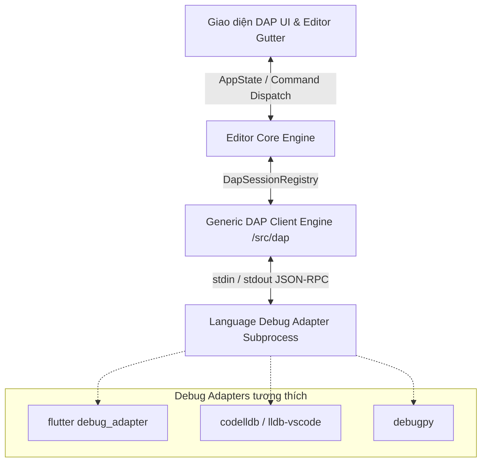

# Kiến trúc Built-in Debugger: Hệ thống Generic DAP Client trong Netherize Editor

Để debugger không chỉ chạy riêng cho Flutter mà trở thành một hạ tầng cốt lõi (Built-in Subsystem) của Netherize Editor, phục vụ cho việc debug mọi ngôn ngữ sau này (Rust, C++, Go, Python...), chúng ta sẽ thiết kế hệ thống theo chuẩn **Debug Adapter Protocol (DAP)** của Microsoft.

Kiến trúc này tách biệt hoàn toàn phần giao diện (UI), lõi Editor (Core) và phần giao thức kết nối với các trình gỡ lỗi đặc thù của từng ngôn ngữ (Debug Adapters).

---

## 1. Sơ Đồ Kiến Trúc Hạ Tầng DAP Client



### Nguyên tắc thiết kế:
1. **Generic DAP Client (`src/dap`)**: Viết một client JSON-RPC chuẩn hóa, truyền thông qua stdin/stdout (hoặc TCP port) của tiến trình con. Client này độc lập hoàn toàn với ngôn ngữ lập trình.
2. **Standardized State (`DapSession`)**: Lưu trữ trạng thái gỡ lỗi chuẩn hóa: danh sách threads, call stack, variables scopes, active frame, và trạng thái suspend (paused/running).
3. **Language Configuration**: Mỗi ngôn ngữ sẽ định nghĩa một cấu hình Adapter trong file cấu hình (ví dụ: lệnh khởi chạy adapter, tham số truyền vào).
   * **Flutter/Dart**: Chạy `flutter debug_adapter` hoặc `dart debug_adapter`.
   * **Rust**: Chạy `codelldb` hoặc `lldb-vscode`.
   * **Python**: Chạy `python -m debugpy --adapter`.

---

## 2. Thiết Kế Module `/src/dap`

Chúng ta tạo thư mục mới `/src/dap/` cấu trúc tương tự `/src/lsp/`:

### A. `src/dap/types.rs` (DAP Protocol Definitions)
Định nghĩa các Struct serialize/deserialize theo đặc tả của Microsoft DAP:
* **Requests**: `InitializeRequest`, `LaunchRequest`, `SetBreakpointsRequest`, `StackTraceRequest`, `ScopesRequest`, `VariablesRequest`, `ContinueRequest`, `NextRequest` (Step Over), `StepInRequest`, `StepOutRequest`, `DisconnectRequest`.
* **Events**: `InitializedEvent`, `StoppedEvent` (lý do: breakpoint/step/exception), `ContinuedEvent`, `OutputEvent` (log output), `TerminatedEvent`.
* **Custom Requests cho Flutter**: Chuẩn DAP của Dart/Flutter hỗ trợ gửi các request tùy biến để reload/restart:
  * Hot Reload: `{ "command": "customRequest", "arguments": { "request": "hotReload" } }`
  * Hot Restart: `{ "command": "customRequest", "arguments": { "request": "hotRestart" } }`

### B. `src/dap/client.rs` (DAP Process Handler)
* Quản lý vòng đời tiến trình con của Debug Adapter (ví dụ: `flutter debug_adapter`).
* Chạy một luồng đọc (stdout reader) chuyên biệt để nhận các gói JSON-RPC phản hồi hoặc Event bất đồng bộ từ adapter.
* Đánh số thứ tự gói tin gửi đi (`seq`) và map phản hồi trả về qua kênh `oneshot::Sender`.

### C. `src/dap/session.rs` (DAP Session State)
* Quản lý trạng thái hiện tại của phiên debug:
  * Isolate/Thread ID nào đang bị paused.
  * Danh sách Stack Frames hiện tại.
  * Ánh xạ Variables của scope đang xem (để vẽ lên cây phân cấp biến cục bộ).
* Gửi kết quả cập nhật về Event Loop của IDE để vẽ lại giao diện.

---

## 3. Các Phím Tắt & Luồng Điều Hướng Tương Tác

### A. Định nghĩa phím tắt trong `config/keymaps/default.toml`
```toml
# ── PHÍM TẮT ĐIỀU HƯỚNG PANEL ──
[[bindings]]
key = "ctrl+f"
command = "app.focus_explorer"  # Focus vào File Explorer (Panel trái)

[[bindings]]
key = "space d b"
command = "app.focus_dap"       # Focus vào DAP Debugger Panel (Panel trái)

# ── PHÍM TẮT DEBUG TOÀN CỤC ──
[[bindings]]
key = "F5"
command = "dap.continue"        # Chạy debug / Tiếp tục chạy khi dừng

[[bindings]]
key = "F6"
command = "dap.hot_restart"     # Hot Restart (qua customRequest của DAP)

[[bindings]]
key = "Shift+F5"
command = "dap.stop"            # Dừng debug

[[bindings]]
key = "F10"
command = "dap.step_over"       # Đi qua (Next)

[[bindings]]
key = "F11"
command = "dap.step_into"       # Đi vào (Step In)

[[bindings]]
key = "Shift+F11"
command = "dap.step_out"        # Đi ra (Step Out)

# ── TRONG PANEL DAP ──
[[bindings]]
mode = "normal"
key = "z a"
command = "dap.toggle_expand"   # Collapse/Expand section hoặc dòng biến số đang chọn
```

---

## 4. Thiết Kế Chi Tiết Giao Diện DAP & Debug Console

### A. Giao diện DAP (Panel Trái)
Khi Panel trái active tab `PanelTabId::Inspector` (DAP), giao diện sẽ hiển thị 4 vùng dọc, tự động tính toán kích thước khi người dùng nhấn `za`:

1. **Variables (Biến số)**:
   * Hiển thị danh sách các biến cục bộ thu được từ DAP request `scopes` -> `variables`.
   * Hỗ trợ dạng cây phân cấp (nhấn `za` hoặc `Enter` để expand các thuộc tính sâu hơn của object nhờ `variableReference` của DAP).
2. **Watch (Theo dõi)**:
   * Cho phép thêm biểu thức cần theo dõi. Khi suspend, DAP Client tự động gọi `evaluate` cho từng biểu thức và hiển thị kết quả.
3. **Call Stack (Ngăn xếp)**:
   * Hiển thị danh sách Stack Frames thu được từ request `stackTrace`.
   * Dòng suspended hiện tại sẽ có dấu chấm màu đỏ nổi bật `●`. Nhấn `Enter` vào một frame sẽ nhảy thẳng tới file và dòng code tương ứng trong editor.
4. **Breakpoints (Điểm dừng)**:
   * Liệt kê tất cả các file và dòng đang đặt breakpoint. Cho phép bật/tắt nhanh breakpoint.

**Thuật toán chia chiều cao động với `za`**:
* Chiều cao mặc định của Section Header khi collapse: $H_{collapsed} = 26.0\text{ px}$.
* Chiều cao khả dụng cho các section đang mở:
  $$H_{expanded} = \frac{H_{total} - (N_{collapsed} \times H_{collapsed}) - \text{Gaps}}{N_{expanded}}$$

### B. Debug Console (Panel Dưới)
* Khi tiến trình Debug Adapter gửi các event `OutputEvent` (logs, print statements, exception stack trace), DAP Client sẽ chuyển hướng dữ liệu này tới tab **Debug Console** (`PanelTabId::DebugConsole`).
* Render văn bản tuần tự kèm màu sắc tiêu chuẩn (màu đỏ cho lỗi/stderr, màu trắng cho log thường, màu xanh cho thông tin debug).

---

## 5. Lộ Trình Triển Khai Kỹ Thuật (Step-by-Step Implementation)

### Giai đoạn 1: Xây dựng Module lõi `src/dap/` (Generic DAP Protocol)
1. Tạo thư mục `src/dap/` và định nghĩa các struct của chuẩn DAP trong `types.rs`.
2. Tạo `client.rs` để xử lý việc khởi chạy Adapter process dưới dạng `tokio::process::Child`, quản lý luồng ghi vào stdin và đọc từ stdout.
3. Tạo `session.rs` để quản lý luồng dữ liệu state (threads, frames, variables, breakpoints).

### Giai đoạn 2: Tích hợp Giao diện DAP UI (Panel Trái) & Console (Panel Dưới)
1. Thêm nhãn `"DAP"` cho `PanelTabId::Inspector`.
2. Triển khai thuật toán tính chiều cao động trong `src/workbench/inspector_panel.rs` cho 4 section của DAP.
3. Liên kết phím tắt `za` để gọi hàm `toggle_expand()` của section hoặc của biến số đang chọn.
4. Tạo giao diện render log cho tab **Debug Console** tại Panel dưới.

### Giai đoạn 3: Hiện thực hóa Flutter Debug Adapter
1. Triển khai lệnh chạy ngầm `flutter debug_adapter`.
2. Khi khởi chạy, gửi request `initialize`, sau đó gửi request `launch` kèm thông số cấu hình:
   ```json
   {
     "program": "lib/main.dart",
     "toolArgs": ["-d", "active_device_id"]
   }
   ```
3. Lắng nghe `OutputEvent` của Dart VM gửi về và đẩy vào tab Debug Console.
4. Gửi customRequest `hotReload` khi lưu file bất kỳ, hoặc `hotRestart` khi nhấn `F6`.

### Giai đoạn 4: Đồng bộ Breakpoint & Highlight Trực Quan trong Editor
1. Khi người dùng click hoặc dùng phím tắt toggle breakpoint trong editor, gọi `DapSession::set_breakpoints` để đồng bộ vị trí dòng sang adapter thông qua request `setBreakpoints`.
2. Khi nhận event `stopped` từ adapter, highlight dòng suspended màu vàng trong editor và hiển thị giá trị biến inline ở cuối dòng.
3. Khi nhận event `continued`, xóa highlight và con trỏ dừng ở gutter.
